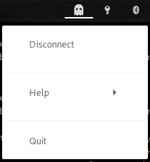

GhostRicon
==========

`GhostRicon` is a GUI companion application for the [CyberGhost](https://www.cyberghostvpn.com/en_US/)
VPN client.

 

How it works
------------

`GhostRicon` is just a wrapper around the CyberGhost VPN client for Linux. You
have to have it installed and configured first.
Then `GhostRicon` will just run the `cyberghostvpn` command behind the scene.
In order to achieve that, `GhostRicon` has to fork a subprocess and request
administrator password through [pkexec](https://linux.die.net/man/1/pkexec).
`GhostRicon` only needs such privileges to run the `cyberghostvpn` command
(just like when you run `sudo cyberghostvpn ...`). Under the hood we actually
drop the privileges for any other action.

Installation
------------

`GhostRicon` is written in python and requires python >= 3.7
Also, for now you need to have [poetry](https://python-poetry.org/) in order to
install the dependencies.

Then you can the following commands:

```
$ git clone https://git.ziirish.me/ziirish/ghostricon
$ cd ghostricon
$ poetry install
```

Running
-------

After you have downloaded `GhostRicon` and installed its dependencies, you just
have to run the `./bin/ghostricon` command.

Configuration
-------------

`GhostRicon` has a few configuration variables in order to make it work the way
you like.
For now, this is only exposed through a configuration file located at
`$HOME/.config/ghostricon/config.ini`.

License
-------

Details are given in the [LICENSE](LICENSE) file.
Also please note that this project and myself are **not** affiliated to
CyberGhost at all.
I am not promoting anything and will not provide any kind of support for the
`cyberghostvpn` solution itself. 
